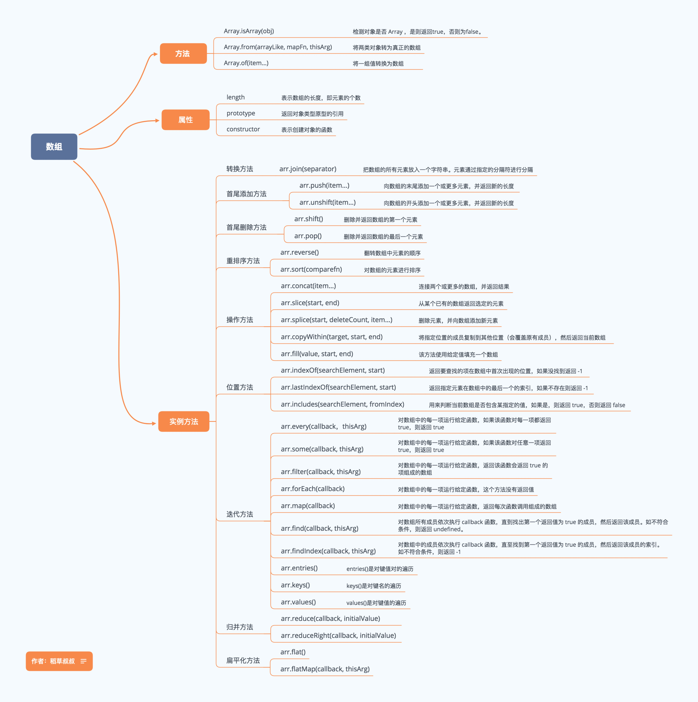

# 多且易乱的方法

js 中对数组操作比比皆是，不管是单纯前端操作数组变量，还是后台返回的数组形式接口数据，都需要用到数组一些方法操作数组。不知道大家是不是和我一样经常忘记或混乱数组一些方法，什么 `find()`，`some()`，`reduce()`等等，还有哪些会改变原始数组哪些返回新数组，真是一头雾水。

## 来张图片压压惊



这张图是我收藏的数组方法图，上面列出了常见的数组方法及解释，界面很舒服，应该一看就懂。

## 看我整理

### 构造函数 `Array` 专属

`Array`构造函数的方法常见有三种：

##### Array.isArray(obj)--- 判断对象是否为数组，返回布尔

```js

Array.isArray([]) // true
Array.isArray({}) // false
```

##### 创建新数组

下面两种方法意在创建新数组，所以我总结在一个大类里面。

比较常见的有两种创建形式，大家可以理解分类记忆。

1. 可以指定规则：从一个迭代器对象或一个伪数组按照一定规则生成新的数组。

`Array.from(arrayLike[, mapFn[, thisArg]])`

参数：

`arrayLike`
想要转换成数组的伪数组对象或可迭代对象。

`mapFn` (可选参数)
既然有规则，必定需要指定规则函数。

`thisArg`(可选参数)
可选参数，执行回调函数 mapFn 时 this 对象。

```js
Array.from('foo')
// ["f", "o", "o"]

let m = new Map([[1, 2], [2, 4], [4, 8]])
Array.from(m)
// [[1, 2], [2, 4], [4, 8]]

Array.from([1, 2, 3], x => x + x)
// [2, 4, 6]
```

2. 没有规则，直接生成

`Array.of(element0[, element1[, ...[, elementN]]])`

参数：

任意参数

```js
Array.of(1)        // [1]
Array.of(1, 2, 3)  // [1, 2, 3]
Array.of(undefined) // [undefined]
```

### 实例对象专属

实例对象的方法是最多的，也是大家容易混淆的，推荐大家从三个大类去记忆。

#### 可以改变原数组（9个）

##### `splice()` 删除元素并且向数组添加新元素

`array.splice(index,howmany,item1,.....,itemX)`

参数：

`index`：必需。整数，规定添加/删除项目的位置，使用负数可从数组结尾处规定位置。

`howmany`：必需。要删除的项目数量。如果设置为 0，则不会删除项目。

`item1, ..., itemX`： 可选。向数组添加的新项目。

```js

var fruits = ["Banana", "Orange", "Apple", "Mango"]

fruits.splice(2,1,"Lemon","Kiwi")

// 结果
// [Banana,Orange,Lemon,Kiwi,Mango]
```

splice() 方法在 ES5 中常用来数组去重，相当经典。

```js
var arr = [1,2,2,3,4,2]
  for(var i=0; i<arr.length; i++){
    for(var j=i+1; j<arr.length; j++){
      if(arr[i]==arr[j]){         //如果第一个和第二个一样，splice方法减去第二个；
        arr.splice(j,1)
        // 设置j-- 防止删除元素后，下面第一位元素遗漏
        j--
      }
    }
  }
// arr [1, 2, 3, 4]
```

##### `sort()` 排序数组

参数：排序规则函数或无参数

没有参数：则按照元素的字母升序，如果不是元素不是字符串的话，会调用toString()方法将元素转化为字符串的Unicode(万国码)位点，然后再比较字符。

排序规则函数：排序规则函数接受两个参数：a , b，返回一个正数或负数。这里教大家一个简单记忆方法：`升序不变返回负，降序改变返回正`。

```js

var a = [1,3,3,5,2,0]  
a.sort()
// [0, 1, 2, 3, 3, 5]

a.sort((a, b) => {
  return a-b // 升序不变返回负，不变指参数位置不变
})
// [0, 1, 2, 3, 3, 5]

a.sort((a, b) => {
  return b-a // 降序改变返回正
})
// [5, 3, 3, 2, 1, 0]
```

下面就是两组头尾删除和添加方法，可以对应记忆

**尾部操作**

##### `pop()` 删除数组最后的一个元素并且返回

参数： 无

##### `push(item1, item2...)` 数组的末尾添加元素并返回新长度

参数：要添加的新元素

```js
// 删除
var a = [1, 3, 5, 7, 9]
a.pop() // [1, 3, 5, 7]
// 添加
a.push(9, 11)
// [1, 3, 5, 7, 9, 11]
```

**头部操作**

##### `shift()` 删除数组第一个元素并返回

参数： 无

##### `unshift(item1, item2...)` 数组头部添加元素并返回新长度

参数：要添加的新元素

```js
// 删除
var a = [1, 3, 5, 7, 9]
a.shift() // [1, 3, 5, 7]
// 添加
a.unshift(0) // [0, 1, 3, 5, 7]
```

##### `reverse()` 颠倒数组中元素的顺序

参数： 无

```js
let  a =  [1,2,3]
a.reverse()
console.log(a)  // [3,2,1]
```

**下面是 ES6 新增的两个方法**

##### `fill(item, start, end)`  用指定元素填充数组

参数：

`item`(必需): 要填充数组的值

`start`(可选): 填充的开始位置,默认值为0

`end`(可选)：填充的结束位置，默认是为this.length

```js
['a', 'b', 'c'].fill(7)
// [7, 7, 7]
['a', 'b', 'c'].fill(7, 1, 2)
// ['a', 7, 'c']
```

##### `copyWithin(target, start, end)` 指定位置的成员复制到其他位置并返回替换后的新数组。

参数：

`target`（必需）：从该位置开始替换数据。如果为负值，表示倒数。

`start`（可选）：从该位置开始读取数据，用哪些数据来替换，默认为 0。如果为负值，表示倒数。

`end`（可选）：到该位置前停止读取数据，默认等于数组长度。使用负数可从数组结尾处规定位置。

```js

 [1, 2, 3, 4, 5].copyWithin(0, -2, -1)
// [4, 2, 3, 4, 5]

var a=['a','b','c','d','e','f','g','h','i','j']
// 2位置开始被替换,3位置开始读取要替换的 5位置前面停止替换
a.copyWithin(2,3,5)
// ["a","b","d","e","e","f","g","h","i","j"]
```

这里可以总结下：

1. 替换前后数组的长度保持不变；

2. 读取数据在终止位置的前一个位置停止，并且保存这个位置的数据不动

3. 读取出来了多少数据，就需要在前面按顺序替换掉多少数据。

上面大类属于可以改变原数组的实例方法，下面一大类当然就是不改变原数组了。

#### 不改变原数组（8个）

##### `slice(start, end)` 截取数组片段，返回新数组

参数：

start：（可选）规定从何处开始选取，负数表示从数组尾部算起

end: （可选）没指定则一直截取到数组最后一个元素，包括最后一个。指定了则截取到指定位置前一个元素。

```js
[1, 2, 3, 4].slice()
//  [1, 2, 3, 4]
[1, 2, 3, 4].slice(1)
// [2, 3, 4]
[1, 2, 3, 4].slice(1, 3)
// [2, 3]
```

##### `join(str)` 按照连接符将数组连接成字符串并返回字符串

参数：

没有参数： 则使用 `,` 连接

有参数： 按照参数指定连接符连接

```js

let a= ['hello','world']
let str=a.join()  // 'hello,world'
let str2=a.join('+')  // 'hello+world'
```

特别注意：当原始数组中含有对象时，使用 `join()` 方法连接时会把对象转成 `[object Object]`字符串，看下面：

```js

var b = [{name: 'pubdreamcc', age: 24}, 'test']
b.join()
// [object Object],test
```

##### `cancat(item1,item2...)` 合并多个数组并返回

参数：

可以是数组对象：等待合并的数组

也可以是具体的值（元素）： 等待合并的元素

```js

var a = [1, 2, 3]
var b = [4, 5, 6]
a.concat(b)
// [1, 2, 3, 4, 5, 6]

a.concat(4, 5, 6)
// [1, 2, 3, 4, 5, 6]
```

##### `toLocaleString()` 数组转字符串

参数： 无

该方法同样也是数组转字符串，是将数组中每一个元素调用自身的`toLocaleString()` 方法后用 `,` 连接得到的字符串。

可以理解为先把数组中每个元素都调用下 `toLocaleString()` 方法，再把得到的结果数组调用 `join()` 方法。

```js
let a=[{name:'pubdreamcc'},24,'cc',new Date()]
a.toLocaleString()
// [object Object],24,cc,2019/7/18 下午1:52:20
```

##### `toString()` 数组转字符串 

这个方法应该比较熟悉，它是定义在 `Object` 原型上面的一个方法，用来把一个对象转成字符串，在这里其实同 `join(无参数)` 方法效果一样。

实际开发中不推荐使用。

##### `indexOf(item, start)` 查找数组某个元素并返回其第一次出现位置下标

参数：

`item`（必需）: 需要查找的元素值

`start（可选）`: 规定在数组中开始检索的位置（0-array.length）

如果没找到，返回 `-1`

```js
var a = [1, 2, 1]
a.indexOf() // -1
a.indexOf(1) // 0
a.indexof('1') // -1
```

注意： indexOf()不能识别NaN， 因为 NaN 与任何数不相等，包括自身。

##### `lastIndexOf(item, fromIndex)` 查找数组某个元素并返回其最后一次出现位置下标

该方法与 `indexOf()` 恰好相反，查找不到同样返回 `-1`

参数:

`item`(必需): 被查找的元素

`fromIndex`(可选): 逆向查找开始位置，默认值数组的长度-1，即查找整个数组。

```js

 let a=['cc',4,'pubdreamcc',1,2,'pubdreamcc',3,4,5,'pubdreamcc'] // 数组长度为10
 // let b=a.lastIndexOf('pubdreamcc',4) // 从下标4开始往前找 返回下标2
 // let b=a.lastIndexOf('pubdreamcc',100) //  大于或数组的长度 查找整个数组 返回9
 // let b=a.lastIndexOf('pubdreamcc',-11) // -1 数组不会被查找
 let b=a.lastIndexOf('pubdreamcc',-9) // 从第二个元素4往前查找，没有找到 返回-1
```

下面这个方法是 ES7 中新增

##### `includes(item, fromIndex)` 查找数组是否包含某个元素返回布尔

参数： 

`item` (必需)：要查找的元素

`fromIndex` (可选)： 默认值为0，参数表示搜索的起始位置，接受负值。正值超过数组长度，数组不会被搜索，返回false。负值绝对值超过长数组度，重置从0开始搜索。

注意： **includes()方法可以检测 `NaN`**

```js
let a=['cc','pubdreamcc',1,NaN]
// let b=a.includes(NaN) // true 识别NaN
// let b=a.includes('pubdreamcc',100) // false 超过数组长度 不搜索
// let b=a.includes('pubdreamcc',-3)  // true 从倒数第三个元素开始搜索
// let b=a.includes('pubdreamcc',-100)  // true 负值绝对值超过数组长度，搜索整个数组
```

总结完了数组的基本两大类方法后，接下来我们开始上数组的遍历方法。

#### 遍历方法 （12个）

数组的遍历也是非常重要，在实际项目开发中用的很多，不同的场景使用不同的遍历方法可以加快我们开发速度。

数组的遍历并不会改变原始数组。

##### `forEach(func, thisValue)` 遍历数组，为每一项执行一次回调函数

参数：

`func`（必需）：指定的回调函数

`thisValue`（可选）：当执行回调函数时`this`绑定对象的值，默认值为`undefined`

```js
array.forEach((value, index, arr) => {}, thisValue)
```

关于 `forEach()` 这里需要注意的几点：

1. 无法中途退出循环，只能用return退出本次回调，进行下一次回调。

2. 它总是返回 undefined值,即使你return了一个值。

3. 如果在回调中需要更改数组中的基本类型数据，请使用 `array[index] = XXX`，不能直接给 `value` 赋值。

##### `every(func, thisValue)` 检测数组所有元素是否都符合判断条件返回布尔

参数：

`func`（必需）：指定的回调函数

`thisValue`（可选）：当执行回调函数时`this`绑定对象的值，默认值为`undefined`

如果有一项元素执行回调返回`false`，剩余元素不再执行回调，整个方法返回 `false`

如果所有元素都满足条件，则整个方法返回 `true`。

```js
[12, 5, 8, 130, 44].every(x => x >= 10) // 判断数组中每个元素是否大于或等于 10
// false
```

##### `some(func, thisValue)` 检测数组中的是否有满足条件的元素返回布尔

参数：

`func`（必需）：指定的回调函数

`thisValue`（可选）：当执行回调函数时`this`绑定对象的值，默认值为`undefined`

`some()` 恰好和 `every()` 相反，只要数组中有一项满足条件判断，则整个方法返回 `true`，如果全部元素都不满足条件，则返回 `false`。

```js
[12, 5, 8, 130, 44].every(x => x >= 10) // 判断数组中是否有元素大于或等于 10
// true
```

##### `filter(func, thisValue)` 按照条件过滤原始数组返回新数组

参数：

`func`（必需）：指定的回调函数

`thisValue`（可选）：当执行回调函数时`this`绑定对象的值，默认值为`undefined`

```js
var arr1 = [1, 3, 8, 4, 6, 7, 2]
var arr2 = arr1.filter((item, index)=>{return item > 5})
// 从原数组中过滤出大于 5 的元素
// [6, 7, 8]
```

##### `map(func, thisValue)` 对数组中每个元素进行一次回调，返回回调返回的元素组成的数组

参数：

`func`（必需）：指定的回调函数

`thisValue`（可选）：当执行回调函数时`this`绑定对象的值，默认值为`undefined`

**可以发现这个几个方法的参数都一样，只是返回值不同而已**。

```js
let a1 = ['1','2','3','4']
let a2 = a1.map((value, index) => {
  return +value
})
// [1, 2, 3, 4]
```

##### `reduce(func, initialValue)` 为数组提供一个累加器，把数组合并为一个值

`reduce()` 方法很多人搞的不是很清楚，也包括自己，讲真的这个方法还真有点绕，但是弄明白之后确实可以给我们带来很多的便利。

参数：

`func`（必需）：指定的回调函数

`initialValue`（可选）：传递给回调的初始值，说白了即是回调第一个参数 `prev` 的初始值。

`func(prev, curr, currIndex, arr)`

参数解析：

`prev`（必需）: 函数上一次 `return` 回来的值。如果提供了 `initialValue`，则初始值为`initialValue`，如果没有提供，则 `prev`初始值为数组第一个元素。

`curr`（必需）: 当前执行回调时，数组中的元素

`currIndex`（可选）: 当前执行回调时，数组中元素的下标

`arr`（可选）：当前元素所属的数组对象


利用 reduce() 方法 我们操作数组更加方便，例如一些常见的例子：

1. 数组元素求和

```js
var arr = [1, 3, 5, 7, 9]
var sum = arr.reduce((prev, curr) => {
  return prev+curr
})
// 25
```

2. 统计数组中元素出现的次数

```js
var arr = ['cc', 'cc1', 'cc', 'cc2', 'cc1', 'cc', 'cc5']
var obj = arr.reduce((prev, curr) => {
  if (!prev[curr]) {
    prev[curr] = 1
  } else {
    prev[curr] += 1
  }
  return prev
}, {})

// {'cc': 3, 'cc1': 2, 'cc2': 1, 'cc5': 1}
```

##### `reduceRight(func, initialValue)` 从右至左的方向把数组累加为一个值

该方法同上面讲的 reduce() 方法使用基本一致，只不过累加的方式为数组的末尾向前将数组中的数组项做累加。

下面几个关于遍历的方法是 ES6 新增的，一种关于查找，一种是关于遍历。

##### `find(func, thisValue)` 找出第一个符合条件的数组成员并返回 

参数：

`func`（必需）：指定的回调函数

`thisValue`（可选）：当执行回调函数时`this`绑定对象的值，默认值为`undefined`

如果没有找到，则返回 undefined

```js
var arr = [1, 3, 5, 7]
var num = arr.find((item, index) => {return item > 1})
// 3
```

##### `findIndex(func, thisValue)` 找出第一个符合条件的数组成员下标并返回 

参数：

`func`（必需）：指定的回调函数

`thisValue`（可选）：当执行回调函数时`this`绑定对象的值，默认值为`undefined`

如果没有找到则返回 `-1`

```js
var arr = [1, 3, 5, 7]
var index = arr.findIndex((item, index) => {return item > 1})
// 1
```

注意：

**这两个方法都可以识别 `NaN`,弥补了`indexOf` 的不足**。


##### `keys()&values()&entries()` 遍历键名、遍历键值、遍历键名+键值

这三种方法都会返回一个新的 `Array Iterator` 对象

`array.keys()` 返回一个包含数组所有下标组成的 Iterator。

`array.values()` 返回一个包含数组所有元素组成的 Iterator。

`array.entries()` 返回一个包含数组元素加下标组成的 Iterator。

返回的 遍历器 可以用 ES6 提供的 `for...of` 循环来遍历。

```js
for (let index of ['pubdreamcc', 'pubdreamcc1'].keys()) {
  console.log(index)
}
// 0
// 1

for (let item of ['pubdreamcc', 'pubdreamcc1'].values()) {
  console.log(item)
}
// 'pubdreamcc'
// 'pubdreamcc1'

for (let [index, item] of ['pubdreamcc', 'pubdreamcc1'].entries()) {
  console.log(index, item)
}
// 0 "pubdreamcc"
// 1 "pubdreamcc1"
```

# 结语

花了将近一下午的时间来整理出数组的一些方法，希望自己能够更加清晰包括理解 它们 的用法，当然最最重要还是在平时撸码的过程中能够运用到对的地方加快开发效率，毕竟咱们学技术还是要服务于产品，把技术变现呢。

最后，希望你能够细心看完，保证你会有不一样的收获。

# 参考资料

[阮一峰 ES6 数组扩展](http://es6.ruanyifeng.com/#docs/array)

[路易斯 [深度长文]JavaScript数组所有API全解密](http://louiszhai.github.io/2017/04/28/array/)
